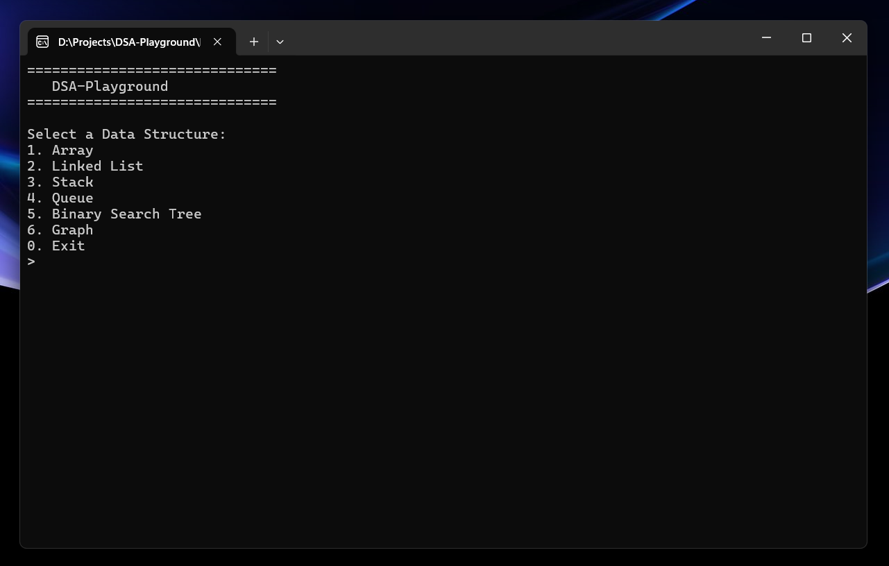

# DSA Playground


> An interactive C++ playground to explore and test core Data Structures — built for engineering clarity and competitive coding mastery.



> 📦 **No setup needed!**  
> Windows users can [download the `.exe`](https://github.com/ShiveshDeogharia/DSA-Playground/releases) and run it directly.

---

## 📌 Overview

**DSA Playground** is a command-line application written in modern C++20 that lets you experiment with key data structures interactively.  
It’s cleanly modularized, namespaced, test-driven, and production-grade — built to impress both engineers and recruiters.

---

## ✨ Features

- ✅ Interactive CLI menus for:
  - Array
  - Singly Linked List
  - Stack
  - Queue
  - Binary Search Tree
  - Undirected Graph (with BFS/DFS)
- ✅ Modular design using `.h/.cpp` files
- ✅ Namespaced under `dsa::` for clean usage
- ✅ Unit tested with GoogleTest
- ✅ CMake build system with GitHub Actions CI

---

## 🚀 How to Build & Run

### 💻 Prerequisites

- CMake ≥ 3.10
- C++ compiler (MSVC, g++, or clang++)
- Git (to clone)
- GoogleTest (automatically downloaded via `FetchContent`)

### 🔧 Build & Run (Windows / Linux / WSL / Mac)

```bash
git clone https://github.com/ShiveshDeogharia/DSA-Playground.git
cd DSA-Playground

# Build
mkdir build && cd build
cmake ..
cmake --build .

# Run the playground
./Debug/dsa_playground.exe  # or just: ./dsa_playground
```

### 🧪 Run Tests

```bash
# From inside build directory
ctest -V
```

---

## 📁 Project Structure

```
DSA-Playground/
├── include/               # All headers (interface + DSA classes)
├── src/                   # All .cpp implementations
├── tests/                 # GoogleTest unit tests
├── .github/workflows/     # CI pipeline (CMake + gtest)
├── CMakeLists.txt         # CMake build file
└── README.md
```

---

## 🛠️ Technologies Used

- C++20
- STL (vector, stack, queue, etc.)
- CMake
- GoogleTest
- GitHub Actions (CI)

---

## ✅ Testing & CI

All core data structures are unit tested with [GoogleTest](https://github.com/google/googletest).  
CI is handled via [GitHub Actions](https://docs.github.com/en/actions), and runs automatically on every push to main.

To manually test:
```bash
cmake --build . --target test
```

---

## 📄 License

This project is licensed under the [MIT License](LICENSE).

---

## 🙌 Credits

Made with ❤️ as a passion project by Shivesh Deogharia.  
Feel free to use, fork, and contribute!
